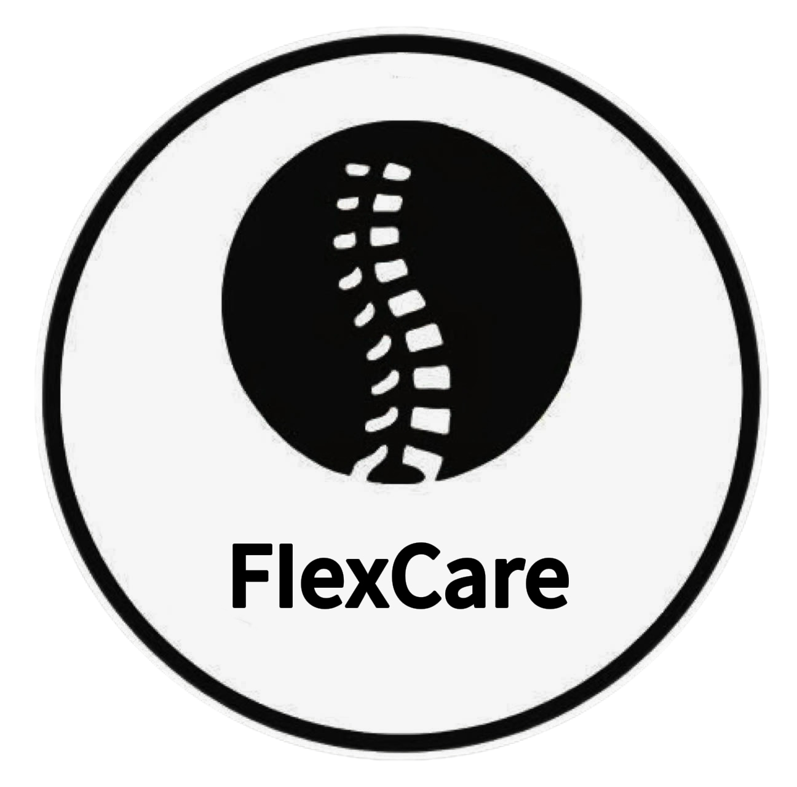

<!DOCTYPE html>
<html lang="vi">
<head>
  <meta charset="UTF-8">

  <meta name="description"
    content="Flexcare Therapy chuyên trị liệu giãn cơ, stretching therapy và phục hồi cơ thể chuyên sâu tại TP.HCM. Đặt lịch nhanh.">

  <title>Flexcare Therapy | Trị liệu giãn cơ tại HCM</title>

  <meta name="viewport" content="width=device-width, initial-scale=1.0">

  <!-- Font -->
  <link href="https://fonts.googleapis.com/css2?family=Poppins:wght@300;500;700&display=swap" rel="stylesheet">

  <!-- Icon -->
  <link rel="stylesheet" href="https://cdnjs.cloudflare.com/ajax/libs/font-awesome/6.5.0/css/all.min.css">

  <!-- Favicon -->
  <link rel="icon" type="image/png" href="IMG_1535.png?v=2">
  <link rel="apple-touch-icon" href="IMG_1535.png?v=2">

  
</head>

<body>

  <!-- HEADER -->

  <header>

    

    <h1>Flexcare Therapy</h1>

    

      Stretching Therapy & phục hồi cơ thể chuyên sâu tại TP.HCM
    

    <a href="https://www.facebook.com/share/1D3qfxdC6s/?mibextid=wwXIfr"
       class="btn">
      Đặt lịch ngay
    </a>

  </header>

  <!-- SERVICES -->

  <section>

    <h2>Dịch vụ của chúng tôi</h2>

    

      

        <h3>Trị liệu phục hồi cơ thể</h3>
        

          Hỗ trợ giảm đau cơ, căng cứng và cải thiện khả năng vận động bằng phương pháp trị liệu chuyên sâu.
        

      

      

        <h3>Massage trị liệu</h3>
        

          Thư giãn cơ bắp và cải thiện tuần hoàn máu.
        

      

      

        <h3>Recovery Therapy</h3>
        

          Hỗ trợ phục hồi sau tập luyện hoặc chấn thương.
        

      

      

        <h3>Body Therapy</h3>
        

          Liệu trình trị liệu giúp giải phóng áp lực cơ bắp và tăng tuần hoàn.
        

      

    

  </section>

  <!-- BENEFITS -->

  <section>

    <h2>Lợi ích khi đến Flexcare</h2>

    

      
✔ Giảm đau lưng, cổ, vai gáy

      
✔ Tăng độ linh hoạt cơ thể

      
✔ Cải thiện hiệu suất tập luyện

      
✔ Thư giãn tinh thần

      
✔ Hồi phục vận động

      
✔ Không thuốc - không xâm lấn

    

  </section>

  <!-- FEEDBACK -->

  <section class="feedback-section">

    <h2>Trải nghiệm của khách hàng</h2>

    

      

        
      

      

        
      

      

        
      

      

        
      

    

  </section>

  <!-- POPUP -->

  

    
  

  <!-- CTA -->

  <section style="text-align:center;">

    <h2>Sẵn sàng trải nghiệm?</h2>

    <a href="tel:0399965500" class="btn">
      Liên hệ đặt lịch ngay
    </a>

  </section>

  <!-- FLOAT CONTACT -->

  

    <a href="https://zalo.me/0399965500"
       target="_blank"
       class="zalo">
      <i class="fa-solid fa-comment"></i>
    </a>

    <a href="https://www.facebook.com/share/1LUgZKGjwU/?mibextid=wwXIfr"
       target="_blank"
       class="fb">
      <i class="fa-brands fa-facebook-f"></i>
    </a>

    <a href="tel:0399965500"
       class="phone">
      <i class="fa-solid fa-phone"></i>
    </a>

  

  <!-- FOOTER -->

  <footer>

    
<strong>Flexcare Therapy</strong>

    

      <i class="fa-solid fa-location-dot"></i>
      521/37 Cách Mạng Tháng 8, P13, Q10, Ho Chi Minh City, Vietnam
    

    

      <i class="fa-solid fa-phone"></i>

      <a href="tel:0399965500"
         style="color:white;text-decoration:none;">
        039 996 5500
      </a>
    

    

      <i class="fa-solid fa-envelope"></i>

      <a href="mailto:flexcare01@gmail.com"
         style="color:white;text-decoration:none;">
        flexcare01@gmail.com
      </a>
    

     

    

      ©  Flexcare Therapy | All rights reserved
    

  </footer>

  <!-- SCRIPT -->

  

</body>
</html>
